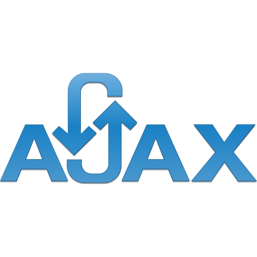
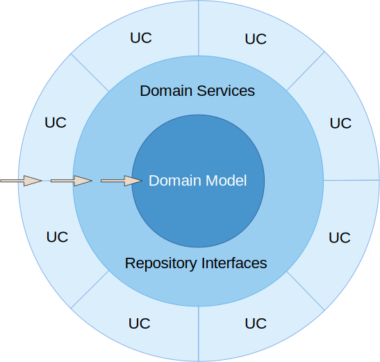

<div align="center">
    <h1>
    Service Radar</h1>
    <h3>
        <a href="#preview">
            Preview
        </a>
        <span> | </span>
        <a href="#quickstart">
            Quickstart
        </a>
        <span> | </span>
        <a href="https://github.com/chrisonoo/ServiceRadar">
            GitHub
        </a>
    </h3>
    <p><i>Base application for searching car services</i></p>
    <p><b>Status: </b>Project completed</p>
    <br>
    <p>Technologies and tools:</p>
    <p>
        
        
        
        
        
        
        
        
        
        
        <br/>
        
        
        
        
        
        
        
        
        
        
    </p>
</div>
<br>

<h2 id="table-of-contents">Table of Contents</h2>

- [Description](#description)
- [Preview](#preview)
- [Quickstart](#quickstart)
- [Functionality](#functionality)
- [Database Schema](#database-schema)
- [Feature List](#feature-list)
- [Technologies, Techniques and Strategies](#technologies-techniques-and-strategies)
- [Dependencies, Tools](#dependencies-tools)
- [Workflow](#workflow)
- [Summary](#summary)
- [Known Issues](#known-issues)
- [Contribution](#contribution)
- [License](#license)
- [About Me](#about-me)

## Description

**`Service Radar`** is a basic web app built with **`ASP.NET Core 7 MVC`**, designed to aid users in locating service centers and repairs workshops.

As an educational tool, it showcases the use of industry-standard technologies and libraries like **`Onion Architecture`**, **`AJAX`**, and **`MediatR`**, ensuring a robust and maintainable codebase.

With components like **`toastr`** for non-blocking notifications, **`FluentValidation`** for validation rules, and **`AutoMapper`** for object mapping, **`Service Radar`** represents modern development practices. Key application components have written **`tests`**, demonstrating the importance of test-driven development.

## Preview

Remember! The application may have bugs. If you want to tell me about the errors found and what I can improve, in the [Contribution](#contribution) section you will find information on how to do it.

### ▫️ User accounts available in the application

Logins and passwords are provided for the application, you can test whatever you want. You can check the scope of rights of individual roles, [Feature List](#feature-list).

```
    ROLE:       Admin
    USER:       admim@test.com
    PASSWORD:   TEst!@12
```

### ▫️ Local way to run the application on computer

There are two ways to run the application. You can do it **locally** on your computer. You don't have to install MSSQL, because Visual Studio has built-in support for simple databases. This method is discussed in the [Quickstart](#quickstart) section.

> Check how to run the application locally: [Service Radar Local](#quickstart)  
> You can use already configured accounts in the application: [User Accounts](#user-accounts-available-in-the-application)

### ▫️ Online version of the application

The application is only `demo app` and may contain bugs, do not submit any sensitive data there. I bear no responsibility for any data loss, and you use the application at your own risk, waiving any claims.

> Preview application online: [Service Radar Online](https://radar.onoo.app/)  
> You can use already configured accounts in the application: [User Accounts](#user-accounts-available-in-the-application)

[[top](#table-of-contents)]

## Quickstart

... under development

[[top](#table-of-contents)]

## Functionality

The application is a simplified version of a car service catalog. Depending on the user's role, it allows for browsing, adding, editing, and deleting workshops. Users with appropriate permissions can also add services to workshops using the AJAX mechanism.

The application allows operation in the following modes, depending on the user's role:

- **Public Mode**: available without logging in
- **User Mode**: available for logged-in users
- **Redactor Mode**: available for logged-in editors
- **Administrator Mode**: available for the logged-in administrator

[[top](#table-of-contents)]

## Database Schema

<details>
<summary>Database Schema Details<h2/></summary>
</details>

[[top](#table-of-contents)]

## Feature List

### ▫️ Public Mode:

- Browse all pages
- Set up a user account

### ▫️ User Mode:

- Log into the user account
- Add workshops
- Edit own workshops
- Add services to own workshops

### ▫️ Redactor Mode:

- Log into the redactor account
- Edit all workshops
- Add services to all workshops

### ▫️ Administrator Mode:

- Log into the admin account
- Add workshops
- Edit all workshops
- Add services to all workshops
- Delete all workshops (hard delete)

[[top](#table-of-contents)]

## Technologies, Techniques and Strategies

- ASP.NET Core 7 MVC
- C# 10
- Entity Framework (utilizing both **Annotations** and **Fluent API**)
- Code First database and Seeding
- Automatic Resource Management with the **using** statement (during seeding)
- SOLID
- CRUD
- CQRS
- Onion Architecture
- DTO, DAO, ViewModel
- Dependency Injection
- Extension Methods
- Middleware
- Data validation
- Unit and integration tests

[[top](#table-of-contents)]

## Dependencies, Tools

... under development

[[top](#table-of-contents)]

## Workflow


[[top](#table-of-contents)]

## Summary

[[top](#table-of-contents)]

## Known Issues

[[top](#table-of-contents)]

## Contribution

[[top](#table-of-contents)]

## License

[[top](#table-of-contents)]

## About Me

Hello, I'm Krzysztof, but feel free to call me Chris. I'm a budding full-stack programmer with a special focus on **`.NET`** and **`SQL`**. Passionate about problem-solving, I enjoy crafting efficient **`backend`** and **`frontend`** solutions.

As an emerging software developer, I'm keen to apply my knowledge and skills in a professional setting. I'm excited to bring my life and professional experience, providing a unique perspective to software development tasks. Eager to commence my journey in the industry, I am **actively seeking employment opportunities** where I can continue to grow and create.

[[top](#table-of-contents)]

Check out my [Portfolio](https://onoo.no/portfolio), [Showroom](https://onoo.app/) with demo apps or connect with me on [LinkedIn](https://www.linkedin.com/in/k-p-z/).

[<div align="center"><br/></div>](https://onoo.no/portfolio)